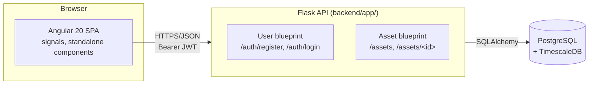
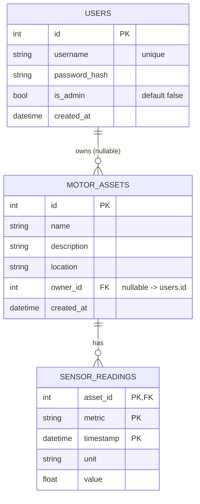
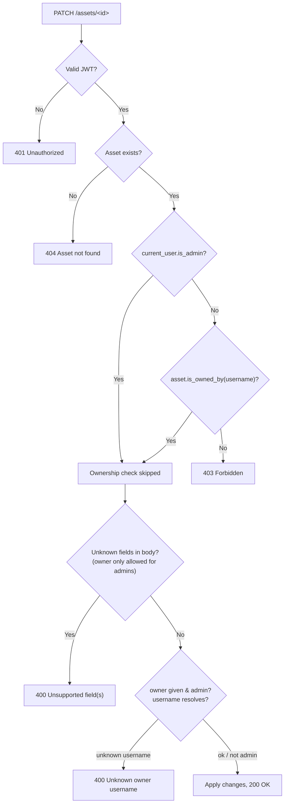

# Motor Asset Manager

A full-stack app for managing **Motor Assets** — electrical motors fitted with
high-frequency sensors — on behalf of an industrial users. Backs two conceptual pages: an **Asset Overview** (paginated, ownership-aware list) and an **Asset Detail** view (full record, limited editing, and per-metric sensor time series charts). Authentication is JWT-based, with a superuser (`is_admin`) role able to edit or reassign any asset.

- **[backend/](backend/README.md)** — Flask 3 + SQLAlchemy JSON API, Postgres +
  TimescaleDB, Flask-Migrate/Alembic, JWT auth.
- **[frontend/](frontend/README.md)** — Angular 20, standalone components + signals, no NgModules.

This document is the system-level view: how the two halves fit together, the data model, the authorization model (and the tests that prove it), and how the sensor time series is set up today versus how it could evolve. Each subproject's own README goes much deeper on its internals and lists every individual design decision — this one doesn't repeat those, only points at them.

## Quick start

```bash
./ci_cd.sh          # install, migrate, test, build, seed, and run both apps
./reset.sh          # wipe local DB + caches back to a blank slate first, if needed
```

`ci_cd.sh` runs the backend (`uv sync` → migrate → `pytest` → seed) and frontend (`npm install` → Karma → `ng build`) pipelines in order, then starts both dev servers.
See [backend/README.md](backend/README.md#setup--local-uv) and [frontend/README.md](frontend/README.md#setup) for running each half independently.

## Development timeline

Built in roughly 6.5 hours, in four phases:

| Order | Phase | Duration | Steps |
|---|---|---|---|
| 1 | Design | 30 min | Frontend/backend needs → Postgres + TimescaleDB choice → folder structure & blueprint packages |
| 2 | Backend | 2h | Models → APIs → auth, authorization & permissions → Swagger → manual testing → unit testing |
| 3 | Frontend | 2h | Login page & top bar → listing page & scroll pagination → asset page & edit form → manual testing → unit testing |
| 4 | Bug fixing, cleanup & docs | 3h | Bug fixes → feature corrections → README writing |

## Architecture



In dev, the Angular CLI's `proxy.conf.js` forwards `/auth`, `/assets`, and `/health` from `localhost:4200` to the Flask app at `127.0.0.1:5000` so the browser only ever makes same-origin requests (see [frontend design decisions](frontend/README.md#design-decisions) for why it's a `.js` proxy and not a `.json` one, and why `127.0.0.1` and not `localhost`).

## Data model



- **`SensorReading` has no surrogate `id`** — its primary key is the natural `(asset_id, metric, timestamp)` triple, which TimescaleDB requires (the partitioning column must be part of every unique index) and which also happens to be exactly how the data is queried.
- **`owner_id` is a real foreign key**, not a free-text field — `GET /assets`  and `GET /assets/<id>` still expose `owner` as a plain username string in JSON, but ownership checks (`is_owned_by`, the `PATCH` guard, `is_owner`) all resolve through the actual relationship, not string matching.
- There used to be a third top-level entity, `Client` (one row per industrial client, shown alongside the logged-in user). It was removed — see [backend design decisions](backend/README.md#design-decisions) — because there was only ever one client and every field on it was static display text; `User` is now the only account/identity concept in the system.

## What each page does

| Page | Frontend | Backend |
|---|---|---|
| Login / Register | `pages/login` — mode toggle, one form | `POST /auth/login`, `POST /auth/register` |
| Asset Overview | `pages/assets-list` — infinite scroll, owned rows highlighted | `GET /assets?page=&per_page=` — owned-first ordering across *all* pages |
| Asset Detail | `pages/asset-detail` — fields, edit form, per-metric charts | `GET /assets/<id>`, `PATCH /assets/<id>` |
| Top bar | `layout/top-bar` — username, id, logout | (reads the `user` persisted at login) |
| Sensor charts | `shared/time-series-chart` — hand-rolled SVG, no charting library | `sensor_metrics` on the detail response |

## Authorization & permissions

Three effective roles, driven by two things: whether the caller is authenticated, and whether `User.is_admin` is true.

| Action | Anonymous | Authenticated, not owner | Authenticated, owner | Admin |
|---|---|---|---|---|
| `GET /assets`, `GET /assets/<id>` | `401` | ✅ (with `is_owner: false`) | ✅ (with `is_owner: true`) | ✅ |
| `PATCH /assets/<id>` — name/description/location | `401` | `403` | ✅ | ✅ (any asset) |
| `PATCH /assets/<id>` — reassign `owner` | `401` | `400` (unsupported field) | `400` (unsupported field) | ✅ |

The decision flow inside `update_asset()` ([backend/app/asset/routes.py](backend/app/asset/routes.py)):



Login itself is a straightforward credential check — no session, just a signed,
short-lived (8h) JWT:


### Verified by executable tests, UnitTests

Every rule above has a corresponding backend test in `backend/tests/`
(`uv run pytest`, 63 tests total) and, where the frontend independently re-implements the same gate for UX, a matching frontend test in `frontend/src/app/...spec.ts` (`npm test`, 62 tests total):

| Rule | Backend test(s) | Frontend test(s) |
|---|---|---|
| Every `/assets` route needs a valid token | `test_assets_list.py::test_requires_auth`, `test_assets_detail.py::test_requires_auth`, `test_assets_update.py::test_requires_auth` | `auth.guard.spec.ts` — *"redirects to /login when the user is not authenticated"* |
| Login only succeeds on matching credentials | `test_auth.py::TestLogin` (`test_login_with_correct_credentials`, `test_login_wrong_password`, `test_login_unknown_username`, `test_login_missing_fields`) | `auth.service.spec.ts` — login/logout persistence tests |
| Passwords are hashed, never compared in plaintext | `test_auth.py::TestRegister::test_registered_password_is_hashed_not_stored_plain`, `test_models.py::TestUserPassword` (all 3) | — |
| Registered passwords must be 8+ characters with a lowercase letter, an uppercase letter, a number, and a symbol; login has no such rule | `test_auth.py::TestRegister` (`test_register_password_too_short`, `test_register_password_missing_lowercase`, `test_register_password_missing_uppercase`, `test_register_password_missing_number`, `test_register_password_missing_symbol`) | `login.spec.ts` — *"requires a complex password in register mode"* / *"does not require a complex password in login mode"* |
| `is_owner` reflects the *requesting* user, not a fixed value | `test_models.py::TestIsOwnedBy` (all 4), `test_assets_list.py::test_is_owner_reflects_current_user`, `test_assets_detail.py::test_is_owner_true_for_owner` / `test_is_owner_false_for_non_owner` | `asset-detail.spec.ts` → *"ownership gating"* describe block |
| List summaries never leak `description`/`owner` | `test_models.py::TestToSummaryDict::test_does_not_leak_description_or_owner` | — |
| Only the owner can `PATCH`; a rejected write never partially applies | `test_assets_update.py::test_owner_can_update_name_description_location`, `test_non_owner_gets_403`, `test_403_does_not_apply_the_change`, `test_asset_with_no_owner_cannot_be_updated_by_anyone` | `asset-detail.spec.ts` — `startEdit()` re-checks, doesn't just hide the button |
| Admin bypasses ownership entirely | `test_assets_update.py::test_admin_can_update_asset_owned_by_someone_else`, `test_admin_can_update_unowned_asset` | `asset-detail.spec.ts` → *"admin capability"* — `isAdmin()`/`canEdit()`, `startEdit` for a non-owner admin |
| Only admins may reassign `owner`; unknown username is `400`; non-admins get the same rejection as any unsupported field | `test_assets_update.py::test_admin_can_reassign_owner`, `test_admin_can_unset_owner`, `test_admin_reassign_to_unknown_username_is_400`, `test_rejects_unknown_field`, `test_non_admin_non_owner_still_gets_403_even_with_owner_field` | `asset-detail.spec.ts` — save includes/omits `owner` based on `isAdmin()`, sends `null` to unassign |
| Requests only carry the token when one exists; a `401` logs out + redirects | — | `auth.interceptor.spec.ts` |

`is_admin` itself has no API surface to grant — self-registration always creates a non-admin account (`POST /auth/register` never accepts an `is_admin` field), so that guarantee is structural rather than something a single test asserts. It can only be set by `scripts/seed.py` or a direct database update — see [backend design decisions](backend/README.md#design-decisions).

## Time series data: current state and future direction

**Today**, sensor readings are synthetic: `backend/scripts/seed.py` generates ~48 hourly Faker-randomized readings per metric per asset and inserts them directly into the `sensor_readings` hypertable. There is no live device, no message queue, and no background worker in this repo — `GET /assets/<id>` just reads whatever rows already exist in Postgres. That's a reasonable stand-in for the assignment scope, but a real deployment would need an actual ingestion path from the motors' sensors into this table (or, as explored below, no table at all). Three shapes that path could take, roughly in order of "this service owns the data" to "this service borrows it":

* **A — Kafka streaming ingestion.** Sensors push events to topics; consumers write directly to `sensor_readings`. Decouples ingestion from write throughput with native replay and backpressure, but introduces Kafka operational overhead.
* **B — Celery beat scheduled polling.** A periodic task polls external APIs on an interval and upserts new records. Avoids extra streaming infrastructure, but bounds ingestion latency and requires a custom scaling strategy for asset fan-out and rate limits.
* **C — Zero-duplication live query.** The API queries an external fleet-wide TimescaleDB/InfluxDB cluster live at request time (`GET /assets/<id>`). Eliminates data duplication and synchronization issues, but tightly couples endpoint latency and availability to the external store.

None of A/B/C is implemented here — this section is a design discussion for "what would need to change for this to be real," not a description of existing code.


### Frontend: live-updating charts (future work)

The sensor charts currently load once, when the Asset Detail page mounts (`GET /assets/<id>` on page load) — there's no live refresh. A natural next step is having the page re-fetch on an interval (RxJS `interval()`/`timer()`, or Angular's `resource()`) so the chart reflects new readings without a manual reload, useful once any of A/B above is actually landing new rows. That's additional future work, not implemented today: it would need to reconcile in-flight requests, probably pause polling when the tab isn't visible, and decide whether to keep re-fetching the full detail payload or add a lighter "latest readings since timestamp" endpoint instead of repeatedly pulling all ~48 points per metric.

## Testing

```bash
cd backend && uv run pytest                                    # 63 tests
cd frontend && npm test -- --watch=false --browsers=ChromeHeadless  # 62 tests
```

See [backend/README.md#automated-tests](backend/README.md#automated-tests) and [frontend/README.md#automated-tests](frontend/README.md#automated-tests) for the full per-file breakdown — the table above only pulls out the auth permission-relevant ones.

## Design decisions

Every non-obvious choice — why blueprints are split the way they are, why Alembic instead of `db.create_all()`, why the dev proxy is a `.js` file, why the SVG chart is hand-rolled, why `Client` was removed, and many more — is written up where it was made:

- **[backend/README.md#design-decisions](backend/README.md#design-decisions)**
- **[frontend/README.md#design-decisions](frontend/README.md#design-decisions)**
